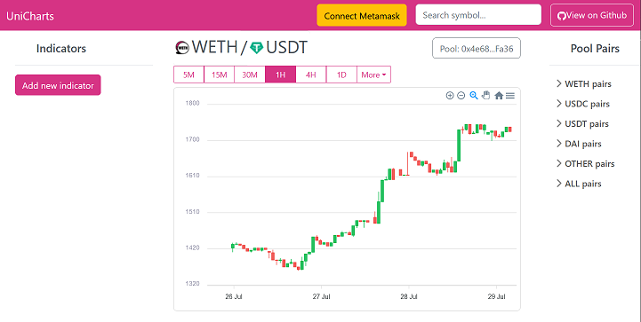

# Uniswap V3 Oracle Reader

The Uniswap V3 Oracle Reader (UV3OR) retrieves historical and current price data from Uniswap V3 pools and saves it to cloud storage. 


The **UV3OR** represents the backend of the website App [UniCharts](https://uniswapv3-charts.herokuapp.com/ "UniCharts"), which allows the user to consult price charts from the most liquid Uniswap V3 pools, on different timeframes.

<div>
    <p style="text-align:center;">
        <a href="./assets/UniChartsPage.png">
            </img>
            <p style="text-align:center;">
                Live UniCharts Demo
            </p>
        </a>
    </p>
</div>

## Running the UV3OR to start storing price data
-------
### Setup
- Clone
- npm install
- Set up a Google Cloud Storage bucket and service account. You can find instructions [here](https://cloud.google.com/appengine/docs/standard/go111/googlecloudstorageclient/setting-up-cloud-storage)

### Setting up environment variables
- RPC_URL &rarr; address of the RPC providers for ethers.js (e.g.  `https://mainnet.infura.io/v3/${infuraProjectID}`)

- BUCKET_NAME &rarr; Unique global name you have given to your Google Cloud Storage bucket
- GOOGLE_APPLICATION_CREDENTIALS &rarr; Path to the local file generated by Google Cloud Storage to authenticate the app. Instructions on generating the _KEY_FILE_ can be found [here](https://cloud.google.com/storage/docs/authentication "Cloud Storage authentication doc")

If you are running the app on a cloud service such as heroku, two more environment variables are needed:
- GCP_CRED
- GCP_KEY_FILE

These variables come from a workaround kindly explained in [this article](https://dilushadasanayaka.medium.com/a-better-way-to-authenticate-google-cloud-services-on-heroku-for-node-js-app-93a0751967dc) by [Dilusha Dasanayaka](https://dilushadasanayaka.medium.com/), which allows for authenticating to Google Cloud storage without having to upload the _KEY_FILE_ to the cloud service running the app.

### Configuring parameters
You can find three main parameter elements in the `parameters.js` file to configure the UV3OR:
- oracleParameters  &rarr; It's an object which includes the main time related parameters of the data to be extracted from the oracle.

```javascript
    const oracleParameters = {
        baseTimeframe: 'seconds30', 
        // At what time interval will the observations be extracted
        // Possible values: seconds1, seconds5, ..., seconds30, minutes1, ..., minutes30, ..., hours1, ...
        // For all the values check the 'timeframes: TimeframeCollection' object in 'uniswapV3Oracle.ts'

        initialLookbackMinutes: 60 * 8,
        // When initializing the pool object and making the first price data request,
        // how far back in time the request will go

        updateLookbackMinutes: 15,
        // When updating new price data after the pool is initialized,
        // how far back in time does the data go

        maxExtraMinutes: 180 
        // After retrieving the first set of observations,
        // when will earliest observations begin to be flushed
        // in order to free up memory from the 'priceLibrary' object
    }
```

- tokenSelectionETH &rarr; It's an array (`string[]`) which includes all the token symbols we want to extract data from.

```javascript
    const tokenSelectionETH = [
        'USDC',
        'ETH',
        'DAI',
        'USDT',
        'WBTC',
        'FRAX',
        'USDM',
        'SWYF',
        'SETH2',
        ...
    ]
```

- quoteTokensETH &rarr; It's an array (`string[]`) where we stablish which tokens will be treated preferably as quote tokens. Therefore, when the app makes all possible token combinations, if one of the tokens are included in this array, the token will be treated as the quote currency. (e.g. for the 'UNI' and 'USDC' pair, the app will guarantee getting the price of 'UNI' in terms of 'USDC' and not the other way around). When both tokens belong to this array, the one order before within the array will be selected as the quote token.

```javascript
    const quoteTokensETH = [
        'USDC',
        'USDT',
        'ETH',
        'WETH',
        'DAI'
    ]
```
### Dealing with the .ts file
The file `uniswapV3Oracle.ts` is written in TypeScript in order to be able to 'talk' to the Uniswap V3 smart contracts. Since the rest of the project is written in JavaScript, this TypeScript file needs to be compiled to JavaScript with the use of the [TypeScript compiler](https://www.typescriptlang.org/docs/handbook/compiler-options.html "tsc CLI Options"), running the command `tsc -p './'`. 

The compiler options are stored in the file `tsconfig.json`.

## Output of the UV3OR
--------
Running the UV3OR generates a json file for each token pair. Once the file is already created, the UV3OR will append any price data generated at timestamps earlier or later than the data already in the file. 

The json file includes information such as the symbol of the pair (e.g. WBTCWETH), basic info of the tokens in the pair (address, decimals, etc) or the address of the pool the pair belongs to. 

```javascript
{
    symbol: 'WBTCWETH',
    baseToken: {
        chainId: 3,
        decimals: 8,
        symbol: 'WBTC',
        name: 'Wrapped Bitcoin',
        isNative: false,
        isToken: true,
        address: '0x2260FAC5E5542a773Aa44fBCfeDf7C193bc2C599'
    },
    quoteToken: {
        chainId: 3,
        decimals: 18,
        symbol: 'WETH',
        name: 'WETH',
        isNative: false,
        isToken: true,
        address: '0xC02aaA39b223FE8D0A0e5C4F27eAD9083C756Cc2'
    },
    poolAddress: '0xCBCdF9626bC03E24f779434178A73a0B4bad62eD',
    poolFee: '3000',
    observationTimeframe: {
        name: '30 seconds',
        seconds:30
    },
    arrayTypes: ['open','high','low','close'],
    extraMinutesData: 180,
    observations: {...},
    startTimestamp: 1656892500,
    endTimestamp: 1656921240,
    maxObservations: 1320
}
```

The price data is stored in an object called `observations`, which contains the timestamps for each price observation as keys and the price _observed_ at each timestamp as values.

Here's an example shows shows the `observations` object with 4 price observations taken at 30 seconds intervals of the price of WBTC per unit of WETH:

```JSON
observations:{
    1656897120: 17.9619096726722,
    1656897150: 17.960412984062202,
    1656897180: 17.952931411493775,
    1656897210: 17.952931411493775
    }
```

One json file is created for each token pair generated from the input parameters which has a Uniswap V3 pool with a liquidity value above 0. Since Uniswap V3 has usually 3 different pools for each token pair, based on the fee level (0.05%, 0.3% and 1%), the pool with highest liquidity out of the 3 of a given pair is chosen for extracting price data.

The complete path of the json file is composed by the name of the folder the file is saved to and the actual name of the file. The folder name represents the base timeframe of the price observations ('1 second', ...,'30 seconds', ...,'5 minutes', ...,'1 hour', ...,'1 day'). The name of the file uses the typical convention for forex pairs (base currency symbol + quote currency symbol).

So for example, the file path `/30 seconds/WBTCWETH.json` contains price observations made every 30 seconds of the price of Wrapped Bitcoin (WBTC) in terms of Wrapped Ether (WETH) or ETH.

## How it works under the hood
--------
The **UV3OR** (reader) uses the [Oracle capabilities](https://docs.uniswap.org/protocol/concepts/V3-overview/oracle "Oracle overview on Uniswap V3 docs") of Uniswap V3 pools to fetch price data, process it and store in the cloud. The **UniCharts** app then reads this data and uses it to display the price charts.

### Main files
- `index.js` &rarr; Creates the `tokenPairsObject` with all possible token pair combinations, it then initializes the pools with `initializeOracle(tokenPairsObject)` and runs an update on the latest prices at a given time interval with `setInterval(updateOraclePrices, updateInterval, tokenPairsObject)`

- `parameters.js` &rarr; It has the main input parameters of the data extraction (time parameters and tokens to be included in the analysis).

- `oracle.js` &rarr; It serves as interface with the functions in the `uniswapV3Oracle.ts` file. The two main functions in this file are `initializeOracle(tokenPairsObject)` and `updateOraclePrices(tokenPairsObject)`.

- `storageLogger.js` &rarr; Contains the main functions necessary to create, read and update files from Google Cloud Storage.

- `uniswapV3Oracle.ts` &rarr; Contains all the functions necessary to communicate directly with the Uniswap V3 pool smart contracts, and the data objects necessary to process and store the data in memory.

### Fetching price data from pool contracts 
Uniswap V3 pools smart contracts include a function called `observe`

```typescript
function observe(uint32[] calldata secondsAgos)
    external
    view
    returns (int56[] memory tickCumulatives, uint160[] memory secondsPerLiquidityCumulativeX128s);
```

According to Uniswap documentation 
>The tick accumulator stores the cumulative sum of the active tick at the time of the observation. The tick accumulator value increases monotonically and grows by the value of the current tick >- per second.

This is explained more in depth in [Uniswap's V3 whitepaper](https://uniswap.org/whitepaper-v3.pdf "Uniswap v3 whitepaper")

For the purpose of simplicity we'll use and example. 
Let's say we what to know the latest price of the WETH USDC pair, and also have the price points (called *observations* by Uniswap) of the last 30 minutes, at 5 minutes interval.
We would need to call the function by calling the `observe` function on the 'WETHUSDC' pool: `poolWETHUSDC.observe([0, 300, 600, 900, 1200, 1500, 1800])`. Notice how the array goes from the present moment *(0 secondsAgo)* up to 30 minutes in the past *(1800 secondsAgo)* at 300 seconds (5 minutes) intervals.

From the output of the `observe` function we get an array under the *tickCumulatives* key:

```javascript
tickCumulatives: [
    '7257579253882',
    '7257517318201',
    '7257455379301',
    '7257393440401',
    '7257331502285',
    '7257269586631',
    '7257207675631'
]
```
The array actually contains `BigNumber` values, which are represented here as strings for the sake of readability.

We would then need to iterate over each interval and extract the price of token1 in terms of token0 by applying the formula given by Uniswap to the *tickCumulatives* values. 

$price_1 = 1.0001^{\frac{tickCumulative[i] - tickCumulative[i-1]}{timestamp[i] - timestamp[i -1]}} \times 10^{decimals_{token1} - decimals_{token0}}$

It's worth noting that the whitepaper, with all the very high level _unicorn mathematics_ it displays :wink:, it doesn't bother to come down to the level of normal, plebeian developers to account for the case when the decimals of both tokens are different. This requires to add or subtract as many decimals as the result of subtracting the decimals of token1 from the decimals of token0, hence the $\times10^{decimals_{token1} - decimals_{token0}}$ term which is added to the original whitepaper equation.

In code:
```
let exponent = (amounts.tickCumulatives[i].sub(amounts.tickCumulatives[i - 1]))/samplingInterval;
price1 = (1.0001 ** exponent) * 10 ** (token1.decimals - token0.decimals);
```

The price of token0 in terms of token1 is obtained by simply calculating the inverse of the price of token1 ($price_0 = \frac{1}{price_1}$)

```
price0 = 1 / price1;
```

In this example, `amounts` is the object returned by the `observe` function and `samplingInterval` corresponds to the difference in seconds between the `secondsAgo` value at each end of the interval (300 seconds).

## Moving forward
There's a few issues which could make the UV3OR a better app:
- **Add the ability to fetch historical data.** At this point, when running the app, the price data it collects goes from the moment the app is started, back to a few thousand timestamps ago. A function could be added in the `index.js` file to account for the case when we want to be able to collect let's say all the 5 minute observations in the last year. Since there is a limit on the size of the array that the `observe` function is capable of returning, it would be needed to add some kind of interation with input arrays that start at different points back in time.

- **Add the possibility of fetching different timeframes at the same time.** At this moment only one timeframe, derived from the parameters file is fetched for a given group of tokens. There could the possibility of fetching different sets of data with their own set of parameters.

- **Add other possiilities of data storage.** The first possibility would be local storage, other cloud storage or database storage possibilities could be added. 